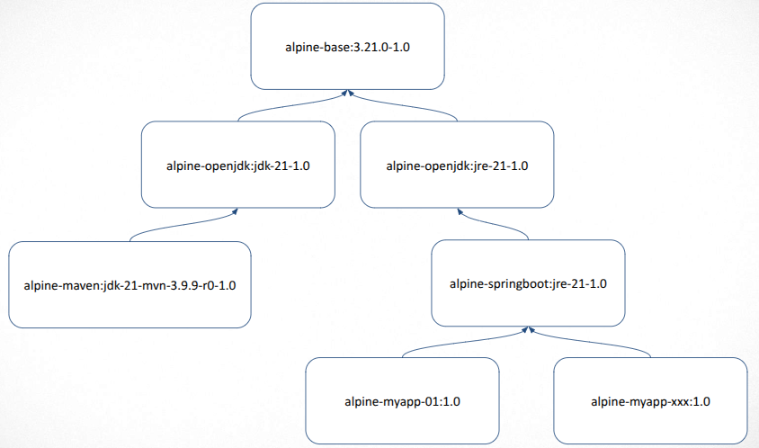

# Custom Docker Images

This repository contains instructions for building and using custom Docker images for various components of your project. Follow the steps below to set up, build, and push your custom Docker images.



## Prerequisites

- Ensure you have Docker installed on your system.
- Ensure you have wget installed on your system.
- Ensure you have nano installed on your system (or use your preferred text editor).

## Setting Up Docker Credential Helpers

1. Verify the Latest Version:

   [Docker Credential Helpers Releases page](https://github.com/docker/docker-credential-helpers/releases)

1. Download the Latest Version:
    ```bash
    wget -O docker-credential-secretservice https://github.com/docker/docker-credential-helpers/releases/download/v0.9.2/docker-credential-secretservice-v0.9.2.linux-amd64
    ```

1. Move the file to /usr/local/bin:
    ```bash
    sudo mv docker-credential-secretservice /usr/local/bin/
    ```

1. Make the file executable:
    ```bash
    sudo chmod +x /usr/local/bin/docker-credential-secretservice
    ```

1. Configure Docker to use the credential helper:

    Once you log in, your password will be saved in the credential store (`secretservice`), so you won't have to type it every time you use Docker commands.

    First, ensure the `~/.docker/` directory exists:

    ```bash
    mkdir -p ~/.docker
    ```

    Then, open the configuration file:

    ```bash
    nano ~/.docker/config.json
    ```

    Add the following content:
    ```json
    {
      "credsStore": "secretservice"
    }
    ```

1. Log in to Docker:

    **Docker now requires a Personal Access Token (PAT) instead of a password.**

    - Visit [Docker Personal Access Tokens](https://app.docker.com/settings) to generate a new token.
    - Use the token as your password when logging in **for the first time**.

    ```bash
    docker login -u <your-docker-username>
    ```

    When prompted for a password, **enter the Personal Access Token instead of your password**.

1. **Future Logins (Optional)**:

    If you ever need to log in again in the future, simply run:

    ```bash
    docker login
    ```

    Docker will use the saved credentials and log you in automatically.

1. **Logging in with a Different Account**:

    If you need to switch accounts, first log out:

    ```bash
    docker logout
    ```

    Then, log in again with the new credentials:

    ```bash
    docker login -u <new-docker-username>
    ```

## Building and Pushing Images

Follow the steps below to build and push Docker images for each component.

### 1. Base Image

Add our custom SSL certificates so all future images already trust them.

1. Build the Image:

    ```bash
    cd 01-base/
    ./build.sh
    ```

1. Push the Image to Docker Hub:

    ```bash
    ./push.sh
    ```

1. Enter the Container Interactively:

    To start an interactive session inside the container and inspect its contents, use the following command:

    ```bash
    docker run --rm -it lsampaioweb/alpine-base:3.21-1.0 sh
    ```

### 2. JDK

Provide a JDK environment for Java application builds.

1. Build the Image:

    ```bash
    cd 02-jdk/
    ./build.sh
    ```

1. Push the Image to Docker Hub:

    ```bash
    ./push.sh
    ```

### 3. JRE

Provide a JRE environment for running Java applications.

1. Build the Image:

    ```bash
    cd 03-jre/
    ./build.sh
    ```

1. Push the Image to Docker Hub:

    ```bash
    ./push.sh
    ```

### 4. Maven

Provide Maven with pre-configured settings for builds.

1. Build the Image:

    ```bash
    cd 04-maven/
    ./build.sh
    ```

1. Push the Image to Docker Hub:

    ```bash
    ./push.sh
    ```

### 5. SpringBoot

Optimized environment for SpringBoot applications.

1. Build the Image:

    ```bash
    cd 05-springboot/
    ./build.sh
    ```

1. Push the Image to Docker Hub:

    ```bash
    ./push.sh
    ```

## Cleaning Up Unused Resources

1. Remove unused images, containers, networks, and volumes:

    ```bash
    docker system prune -a --volumes
    docker system prune -a --filter "until=96h" -f
    ```

## Use the Default Docker Images from Docker Hub

### 1. My App 01

1. Firewall Configuration (Ubuntu with UFW):

    If you are using **Ubuntu** with **UFW enabled**, you need to allow the necessary ports for Spring Boot applications:

    ```bash
    sudo ufw allow 8080/tcp comment "Allow Spring Boot HTTP (8080)"
    sudo ufw allow 8081/tcp comment "Allow Spring Boot HTTP (8081)"
    sudo ufw allow 9443/tcp comment "Allow Spring Boot HTTPS (9443)"
    sudo ufw allow 443/tcp comment "Allow HTTPS (443)"
    ```

    After adding the rules, reload UFW to apply the changes:

    ```bash
    sudo ufw reload
    ```

    You can verify that the rules are active by running:

    ```bash
    sudo ufw status
    ```

1. [HTTPS](https.md)
    - Securing your application with HTTPS.

1. Compile the application:

    ```bash
    cd 06-my-app-01/
    mvn clean package
    mvn clean package -DskipTests
    ```

1. Run the application locally:

    ```bash
    mvn spring-boot:run
    ```

1. Or build and run using the Docker image:

    ```bash
    docker build -t lsampaioweb/alpine-myapp:1.0 .
    ```

1. Create other `tags` for the image:

    The `4e55c0a5fd09` is my current tag.

    ```bash
    docker tag 4e55c0a5fd09 lsampaioweb/alpine-myapp:latest
    docker tag 4e55c0a5fd09 lsampaioweb/alpine-myapp:stable
    ```

1. Fixing Log Directory Permissions (If Needed):

    By default, the **Docker image runs as the `app` user with UID 1112**. If the log directory on the host has incorrect ownership, the application may fail to write logs.

    If you cloned this repository and the setting was lost, **ensure the logs directory has the correct owner** by running:

    ```bash
    sudo chown -R 1112:1112 ./logs
    ```

1. Run the application:

    ```bash
    docker compose up -d
    ```

1. View logs:

    ```bash
    docker compose logs -f my-app
    ```

1. Start an interactive shell session inside the running container:

    ```bash
    docker exec -it my-app sh
    ```

1. Shut down the application:

    ```bash
    docker compose down
    ```

1. Push the Image to Docker Hub:

    ```bash
    docker push lsampaioweb/alpine-myapp:1.0
    docker push lsampaioweb/alpine-myapp:latest
    docker push lsampaioweb/alpine-myapp:stable
    ```

#
### Created by:

1. Luciano Sampaio.
