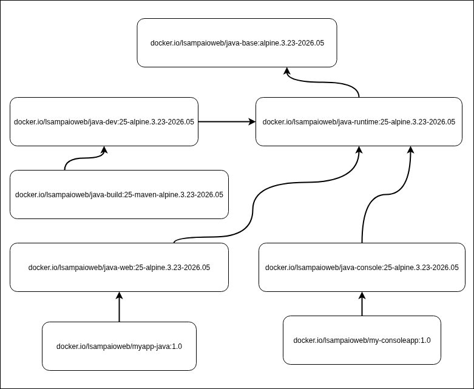

# Java Container Images

This guide provides instructions for building, pushing, and using standardized Java Container images. These images are designed to provide a consistent foundation for Java development and deployment across different environments.



## Quick Start - Build All Images

For convenience, you can use the following helper scripts to build, tag, and push all images at once:

- **Build All Images**:
  ```bash
  ./scripts/build-all-java.sh
  ```

- **Tag All Images**:
  ```bash
  ./scripts/tag-all-java.sh
  ```

- **Push All Images**:
  ```bash
  ./scripts/push-all-java.sh
  ```

These scripts will automatically build, tag, and push all images (JDK 21 and 25 versions) in the correct dependency order. Use the individual commands below if you need to build, tag, or push specific images only.

## Building Images

Below are the steps to build and push each Java image. All commands should be run from the project root (`custom-docker-images/`) unless specified otherwise.

1. **Base Image**

    Foundation image with locale, SSL certificates, timezone configuration, and non-root user setup.

    - **Build**:
      ```bash
      ./scripts/build.sh java 01-base
      ```
    - **Build without using the local cache**:
      ```bash
      ./scripts/build.sh --no-cache java 01-base
      ```
    - **Build with debug mode**:
      It enables Bash trace output (`set -x`) in helper scripts.
      ```bash
      ./scripts/build.sh --debug java 01-base
      ```
    - **Inspect**:
      ```bash
      podman run --rm -it docker.io/lsampaioweb/java-base:alpine.3.23-2026.05 sh
      ```

      - To inspect the container with proxy settings (necessary for network access like `apk update` or `apk search`):
        ```bash
        podman run --rm -it \
          --network=host \
          -e http_proxy="http://localhost:3128" \
          -e https_proxy="http://localhost:3128" \
          docker.io/lsampaioweb/java-base:alpine.3.23-2026.05 sh
        ```

1. **Runtime Environment**

    Lightweight production runtime optimized for executing applications with minimal overhead.

    - **Build**:
      ```bash
      ./scripts/build.sh java 02-runtime 21
      ./scripts/build.sh java 02-runtime 25
      ```
    - **Inspect**:
      ```bash
      podman run --rm -it docker.io/lsampaioweb/java-runtime:25-alpine.3.23-2026.05 sh
      ```

1. **Development Environment**

    Complete development environment with JDK for building and developing applications.

    - **Build**:
      ```bash
      ./scripts/build.sh java 03-dev 21
      ./scripts/build.sh java 03-dev 25
      ```
    - **Inspect**:
      ```bash
      podman run --rm -it docker.io/lsampaioweb/java-dev:25-alpine.3.23-2026.05 sh
      ```

1. **Build Environment**

    Specialized build environment with Maven for CI/CD pipelines.

    - **Build**:
      ```bash
      ./scripts/build.sh java 04-build 21
      ./scripts/build.sh java 04-build 25
      ```
    - **Inspect**:
      ```bash
      podman run --rm -it docker.io/lsampaioweb/java-build:25-maven-alpine.3.23-2026.05 sh
      ```

    - **Test Maven Builds with Your Application**:

      Mounts the sample application (`java/10-my-app-01`) into the container and starts an interactive shell to test Maven builds.

      - **Start an Interactive Shell**:

        Starts an interactive shell inside the Maven container with the sample application mounted.
        ```bash
        podman run --rm -it \
          -v $(pwd)/java/10-my-app-01:/opt/app \
          -v ~/.m2/:/root/.m2 \
          -w /opt/app \
          docker.io/lsampaioweb/java-build:25-maven-alpine.3.23-2026.05 \
          sh
        ```

      - **Build the Application with Maven**:

        Compiles and packages the application using Maven.
        ```bash
        mvn clean package
        ```

1. **Console Application**

    Production-optimized environment for console and CLI applications.

    - **Build**:
      ```bash
      ./scripts/build.sh java 05-console 21
      ./scripts/build.sh java 05-console 25
      ```
    - **Inspect**:
      ```bash
      podman run --rm -it docker.io/lsampaioweb/java-console:25-alpine.3.23-2026.05 sh
      ```

1. **Web Application**

    Production-optimized environment for Spring Boot web applications with appropriate runtime configurations.

    - **Build**:
      ```bash
      ./scripts/build.sh java 06-web 21
      ./scripts/build.sh java 06-web 25
      ```
    - **Inspect**:
      ```bash
      podman run --rm -it docker.io/lsampaioweb/java-web:25-alpine.3.23-2026.05 sh
      ```

## Testing the Sample Application

1. **Sample App**

    A sample Spring Boot application using our base images.

    - **Allow binding on ports below 1000**:

      To allow the application to bind to privileged ports (like 80 and 443) without using `sudo`, you need to grant the `cap_net_bind_service` capability to the Java executable.

      1. Find your Java executable path:

          You can usually find this by running `which java` in your terminal. If that points to a symbolic link (like `/usr/bin/java`), you might need to follow the link to the actual executable. You can use `readlink /usr/bin/java` or `ls -l /usr/bin/java` to find the target. The actual executable is often located under `/usr/lib/jvm/...`.

      1. Grant the capability:

          Once you have the full path to your Java executable, run the following command, replacing `/path/to/your/java` with the correct path:

          ```bash
          sudo setcap 'cap_net_bind_service=+ep' /path/to/your/java
          sudo setcap 'cap_net_bind_service=+ep' /usr/lib/jvm/java-25-openjdk-amd64/bin/java
          ```

    - **HTTPS Configuration**:

      See [HTTPS Configuration](https.md) for securing your application with HTTPS.

    - **Change to the Application Directory**:

      Some commands below require you to be in the `java/10-my-app-01` directory:
      ```bash
      cd java/10-my-app-01
      ```

    - **Compile and Package**:
      ```bash
      mvn clean package
      ```

    - **Run Locally**:
      ```bash
      mvn spring-boot:run
      mvn spring-boot:run -Dspring-boot.run.profiles=development
      mvn spring-boot:run -Dspring-boot.run.profiles=production
      ```

    - **Access**:

      Navigate to the following URLs:

      1. Local HTTP endpoint:
          ```bash
          http://localhost:8080/api/v1/hello
          ```

      1. HTTPS endpoint:
          ```bash
          https://localhost:9443/api/v1/hello
          ```

    - **Build `Single Stage`:**
      ```bash
      podman build -t docker.io/lsampaioweb/myapp-java:1.0 . 2>&1 | tee logs/build-single-stage.log
      ```

    - **Build `Multi Stage`:**
      ```bash
      podman build -t docker.io/lsampaioweb/myapp-java:1.1 \
        --network=host \
        --http-proxy=false \
        --isolation chroot \
        --pull=missing \
        -f Dockerfile-multi-stage . 2>&1 | tee logs/build-multi-stage.log
      ```

    - **Tag**:
      ```bash
      podman tag docker.io/lsampaioweb/myapp-java:1.0 docker.io/lsampaioweb/myapp-java:latest
      ```

    - **Push**:
      ```bash
      podman push docker.io/lsampaioweb/myapp-java:1.0
      ```

    - **Adjust Directory Permissions (For Host Volumes)**:

      If you mount directories from the host (like `./logs` or `./ssl`), the container's internal user (`app`, UID 1654) must have permission to read/write them.

      Since you are using rootless Podman, file ownership is mapped to "sub-UIDs" on the host.

      Use `podman unshare` to apply the correct permissions without needing manual calculations:

      - Map the host directories to the container's 'app' user (UID/GID 1654).
        ```bash
        podman unshare chown -R :1654 ./logs/container/
        podman unshare chown -R :1654 ./ssl/
        ```

      - Ensure the directories are writable by the owner and group.

        - g+r  = Group can Read.
        - g+w  = Group can Write.
        - g+X  = Group can 'Execute' directories (traverse them), but NOT files.
        - g+s  = Set Sticky Bit (New files inherit the group 1654).
        ```bash
        chmod -R g+rwX,g+s ./logs/container/
        chmod -R g+rX ./ssl/
        ```

    - **Create Podman Network**:
      ```bash
      podman network create myapp-network
      ```

    - **Using Podman Compose**:
      ```bash
      podman compose up -d
      ```

    - **View Logs**:
      ```bash
      podman compose logs -f myapp-java
      ```

    - **Interactive Shell**:
      ```bash
      podman exec -it myapp-java sh
      ```

    - **Stop**:
      ```bash
      podman compose down
      ```

## Clean Up Local Images

To remove all local images from your machine, use the following command:

- **Remove All Images**:

  Deletes all local images matching the pattern.
  ```bash
  podman image ls --format "{{.ID}} {{.Repository}}" | grep "docker.io/lsampaioweb/java" | awk '{print $1}' | sort -u | xargs -r podman image rm -f
  ```

- **Remove log files**:

  Deletes all log files.
  ```bash
  find java/ -type f -name "*.log" -delete
  ```

[Go Back](../README.md)
